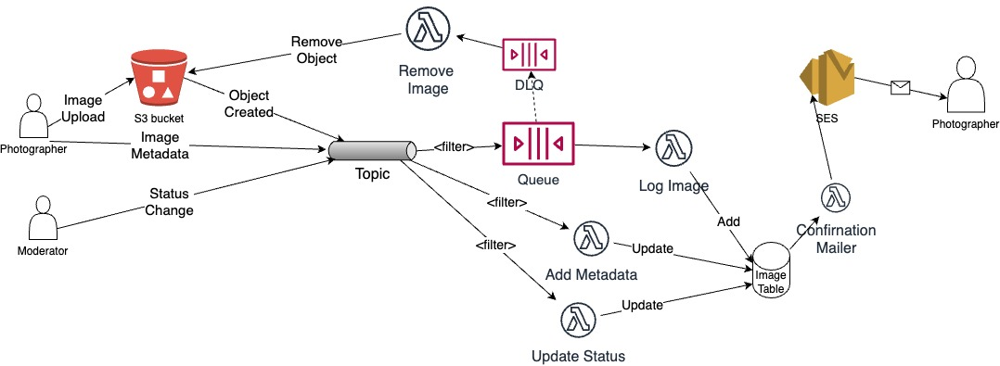

# Distributed Systems - Event-Driven Architecture

__Name:__ Piotr Placzek (20097618)

__Demo__: <https://youtu.be/d8PiSlue7PU>

This repository contains the implementation of a skeleton design for an application that manages a photo gallery, illustrated below. The app uses an event-driven architecture and is deployed on the AWS platform using the CDK framework for infrastructure provisioning.

## Code Status

__Feature:__

+ Photographer:
  + Log new Images - Completed and Tested.
  + Metadata updating - Completed and Tested.
  + Invalid image removal - Completed and Tested
  + Status Update - Completed and Tested.
+ Filtering:
  + Only send S3 events to Queue / "Log Image" lambda - Completed and Tested.
  + Only send events with metadata attributes to "Add Metadata" lambda - Completed and Tested.
  + Only send status update events to "Status Update" lambda - Completed and Tested.
